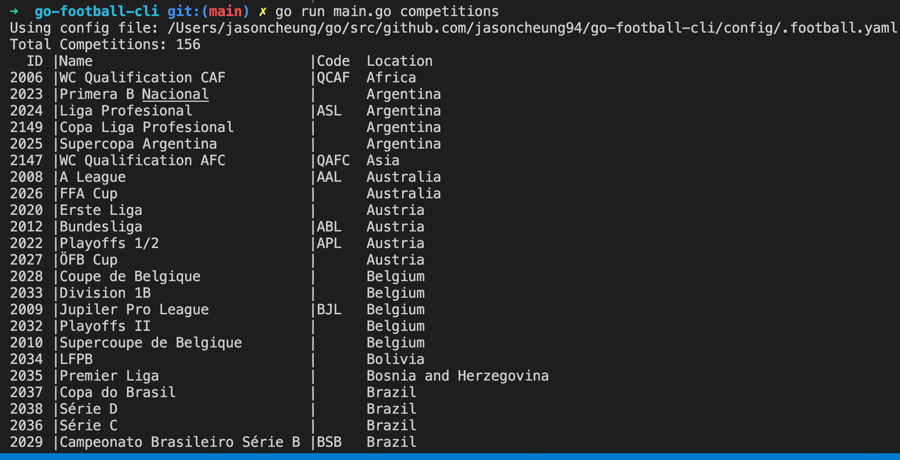
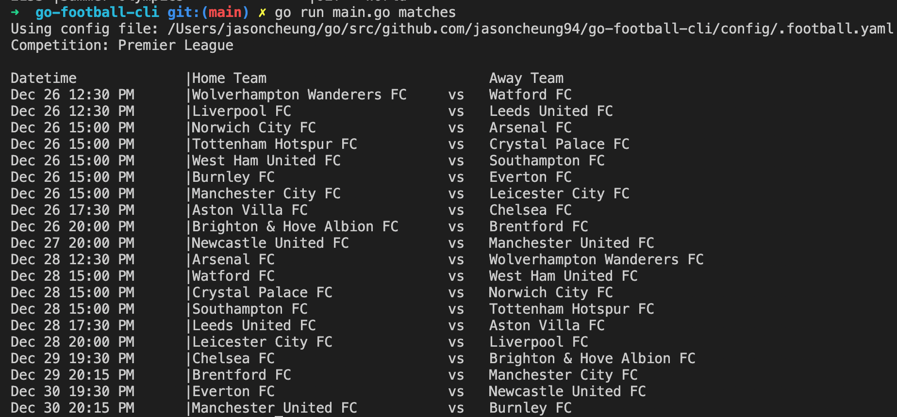
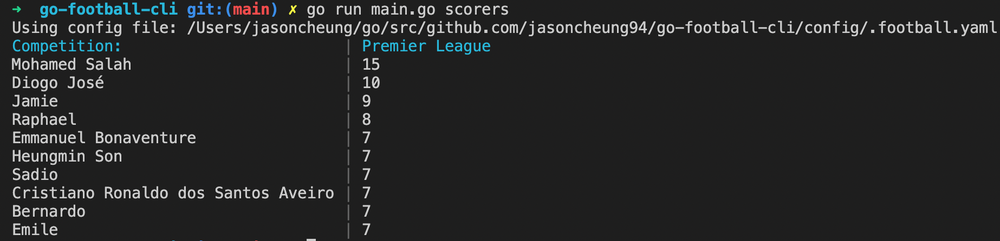
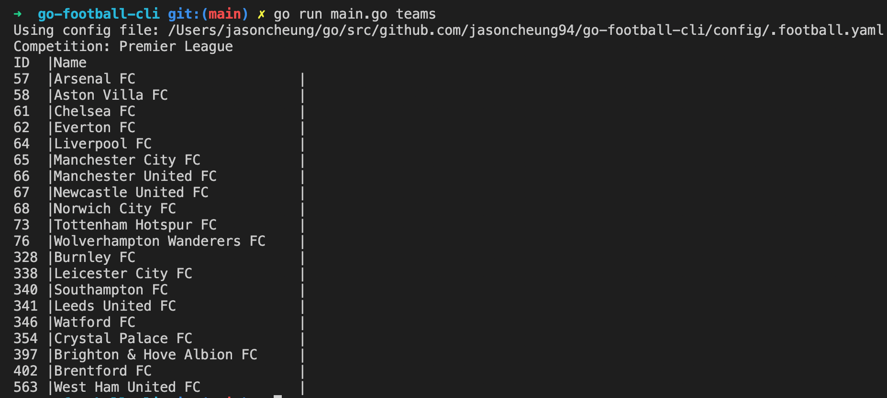

## About The Project
go-football-cli is a project implemented in Go that utilizes the Cobra package. It uses an API to retrieve the latest updates of matches, top scorers, league standings and other information. This project requires an API Key to send HTTP requests otherwise it uses a demo mode which retrieves it's information from saved files located in the data folder. 

### Commands
`go run main.go competitions`

`go run main.go matches`

`go run main.go scorers`

`go run main.go tables`

`go run main.go teams`

#### Links
* [Football API](https://www.football-data.org/)
* [Cobra Package](https://github.com/spf13/cobra)